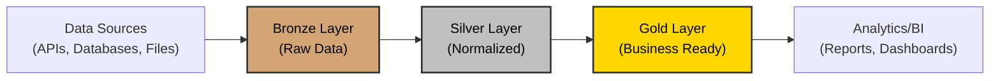
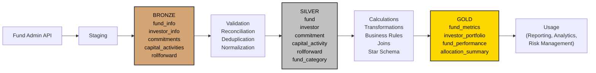

# Medallion Architecture

The Medallion Architecture is a data engineering standard that organizes data into three distinct layers: Bronze, Silver, and Gold. Each layer progressively refines and transforms raw data into a form amenable to business intelligence and analytics.

## Architecture Overview

## Example:

## Documentation

- [Bronze Layer](layers/bronze.md) - Raw data landing zone, staging area
- [Silver Layer](layers/silver.md) - Cleaned and normalized, 
- [Gold Layer](layers/gold.md) - Source of truth for any reporting
- [Bronze → Silver Transition](transitions/bronze-to-silver.md) - Data quality and cleaning
- [Silver → Gold Transition](transitions/silver-to-gold.md) - Aggregation and business logic
- [Best Practices](best-practices.md) - Governance and optimization
- [Technology Stack](technology-stack.md) - Tools and platforms