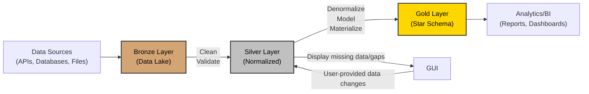

# Medallion Architecture

The Medallion Architecture is a data engineering standard that organizes data into three distinct layers: Bronze, Silver, and Gold. Each layer progressively refines and transforms raw data into a form amenable to business intelligence and analytics.

## Architecture Overview

## Documentation

- [Bronze Layer](layers/bronze.md)
  - Save external data raw with minimal transformation
  - Generally insert-only, no modifying the data, allow processing data multiple times
  - Save metadata about where data came from, when it arrived, what inputs were used for obtaining it, etc.
  - Perform validations to ensure data is self-consistent
- [Bronze -> Silver Transition](transitions/bronze-to-silver.md)
  - Deduplication and cleanup
  - Assign unique identifiers
  - Map or create new internal identifiers
  - Transformation logic (preferably in-memory) into normalized tables
- [Silver Layer](layers/silver.md)
  - Normalized tables (in Snowflake, use hybrid tables)
  - Ensure uniqueness and referential integrity at all times
  - Address any business-level check issues here
- [Silver -> Gold Transition](transitions/silver-to-gold.md)
  - Denormalize into data models useful to the business
  - Transform data and materialize them into tables
  - Perform groupings, aggregations, pre-compute things, etc.
- [Gold Layer](layers/gold.md)
  - Source of truth - never allow incorrect data to exist here
  - Few tables with large number of columns